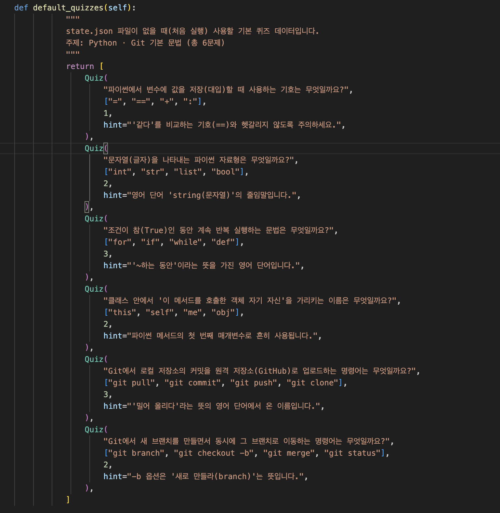
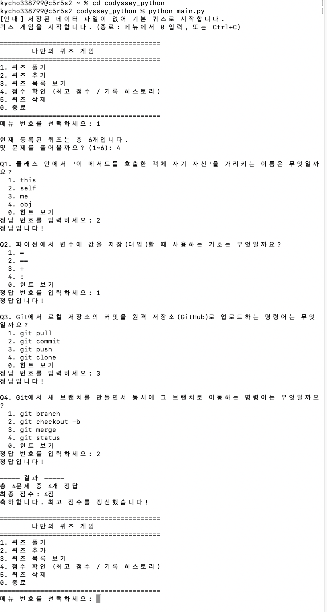
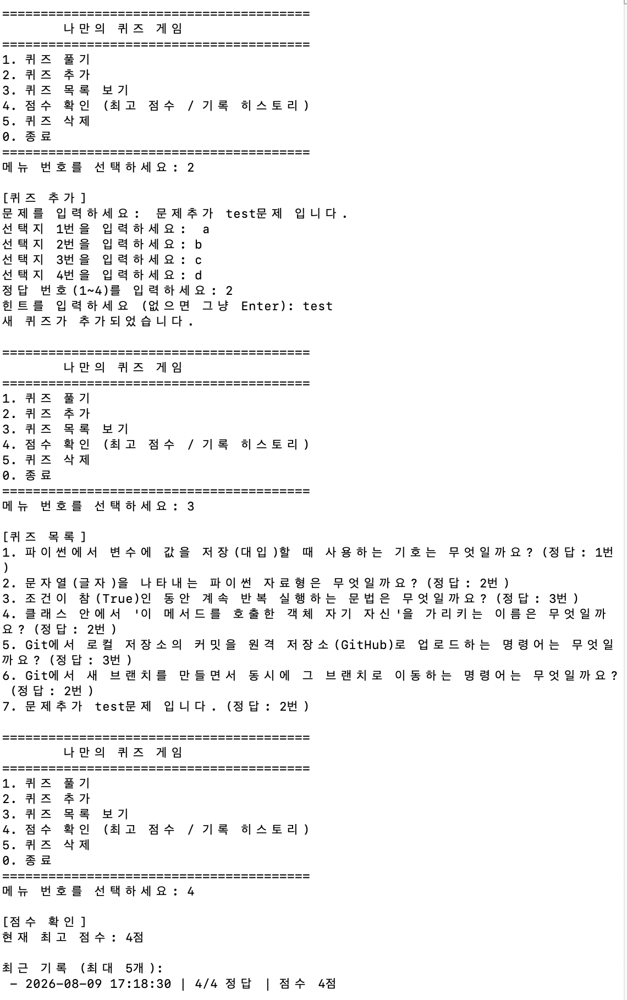
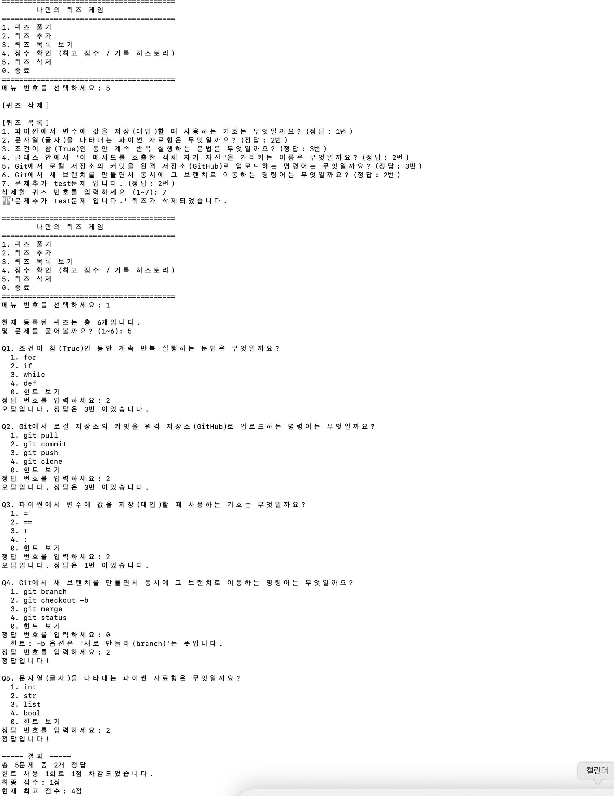
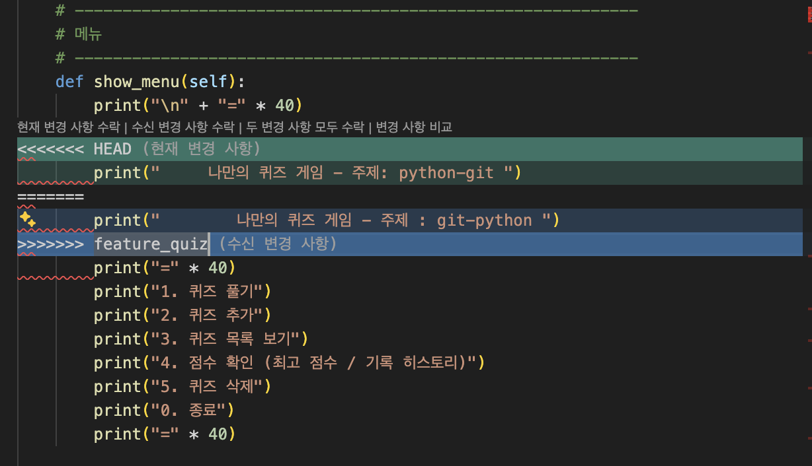

# 나만의 퀴즈 게임 (Quiz Game)

# 목차
* 프로젝트 개요
* 퀴즈 주제와 선정 이유
* 실행 방법
* 기능 목록
* 파일 구조
* 데이터 파일 설명(state.json 경로/역할/스키마)
* Git: README 작성 후 최종 푸시한다.

```
python --version
Python 3.12.13
```
---

## 1. 프로젝트 개요

터미널(명령 프롬프트)에서 실행되는 퀴즈 게임입니다.
문제를 풀고, 새로운 문제를 등록하고, 목록을 확인하고, 점수를 관리할 수 있습니다.
프로그램을 껐다 켜도 등록한 문제와 최고 점수는 `state.json` 파일에 저장되어 사라지지 않습니다.

목표

1. **Python**: 변수·조건문·반복문·함수·클래스·파일 입출력을 실제 프로그램에 적용하는 경험
2. **Git**: 커밋으로 변경 이력을 남기고, 브랜치로 기능을 나누어 작업한 뒤 병합하고, GitHub에 공개하는 경험

## 2. 퀴즈 주제와 선정 이유

**주제: Python · Git 기본 문법**

- 이 미션에서 직접 배우고 사용한 파이썬 문법(변수, 자료형,반복문, `self`)과 Git 명령어(`push`, `checkout -b` 등)를 스스로 복습해 볼 수 있는 주제입니다.
- 프로젝트를 진행하며 실제로 작성한 코드·명령어와 바로 연결되기 때문에,"배운 것을 곧바로 확인하는" 용도로 자연스럽게 활용하는 목적입니다. 
- 총 6문제를 기본으로 등록해, 요구사항(5개 이상)을 충족했습니다.



## 3. 실행 방법

```bash
# 1) 프로젝트 폴더로 이동
cd codyssey_python

# 2) 프로그램 실행 (환경에 따라 python 또는 python3)
python main.py
```
실행 후 화면에 표시되는 메뉴에서 번호를 입력하면 원하는 기능을 사용할 수 있습니다.
숫자가 아닌 값이나 잘못된 범위를 입력해도 프로그램이 멈추지 않고 다시 물어봅니다.



## 4. 기능 목록

### 필수 기능
| 번호 | 기능 | 설명 |
|---|---|---|
| 1 | 퀴즈 풀기 | 등록된 퀴즈를 출제하고, 정답/오답을 알려주고, 결과를 보여줍니다. |
| 2 | 퀴즈 추가 | 문제/선택지 4개/정답 번호를 입력받아 새 퀴즈를 등록합니다. |
| 3 | 퀴즈 목록 | 현재까지 등록된 모든 퀴즈를 보여줍니다. |
| 4 | 점수 확인 | 역대 최고 점수를 보여줍니다. |
| 0 | 종료 | 데이터를 저장하고 프로그램을 안전하게 종료합니다. |




### 보너스 기능
| 번호 | 기능 | 설명 |
|---|---|---|
| 기본보너스 | 랜덤 출제 | `random.shuffle()`로 매번 문제 순서를 섞어서 출제합니다. |
| 기본보너스 | 문제 수 선택 | 몇 문제를 풀지 사용자가 직접 정할 수 있습니다. |
| 기본보너스 | 힌트 기능 | 문제 풀이 중 `0`을 입력하면 힌트를 보여주고, 사용 시 1점을 차감합니다. |
| 5 | 퀴즈 삭제 | 번호를 선택해 등록된 퀴즈를 삭제합니다. |
| 기본보너스 | 점수 기록 히스토리 | 매 플레이의 날짜/시간, 문제 수, 점수를 저장하고, 점수 확인 메뉴에서 최근 기록을 보여줍니다. |

### 공통 예외 처리
- 빈 입력, 숫자가 아닌 입력, 범위를 벗어난 입력을 모두 안내 메시지와 함께 재입력받습니다.
- `Ctrl+C` 또는 입력 중단(EOFError) 시 프로그램이 강제 종료되지 않고, 데이터를 저장한 뒤 안전하게 종료됩니다.
- `state.json`이 없거나 손상되어도 기본 퀴즈로 복구되어 프로그램이 계속 실행됩니다.

## 5. 파일 구조

# structure.md

```
quiz_game/
├── main.py        # 실행
├── quiz.py        # Quiz 클래스 (문제 1개)
├── quiz_game.py    # QuizGame 클래스 (게임 진행 + 저장/불러오기)
├── state.json      # 데이터 저장 파일 (자동 생성)
├── README.md       # 이 문서
├── structure.md     # 폴더 구조 상세 설명
└── .gitignore       # Git 추적 제외 목록
```

## 6. 데이터 파일 설명 (state.json)

- **위치**: 프로젝트 루트 (`quiz_game/state.json`)
- **인코딩**: UTF-8 (한글이 깨지지 않도록 저장/불러오기 시 `encoding="utf-8"`을 명시합니다.)
- **생성 시점**: 프로그램을 처음 실행하고 데이터가 한 번이라도 저장될 때 자동 생성됩니다.

### 데이터설계도

```json
{
  "quizzes": [
    {
      "question": "문제 내용",
      "choices": ["선택지1", "선택지2", "선택지3", "선택지4"],
      "answer": 3,
      "hint": "힌트 문구 (없으면 빈 문자열)"
    }
  ],
  "best_score": 5,
  "history": [
    {
      "datetime": "2026-08-08 21:00:00",
      "total_questions": 6,
      "correct": 5,
      "score": 5
    }
  ]
}
```

| 키 | 타입 | 설명 |
|---|---|---|
| `quizzes` | list | 등록된 퀴즈 전체 목록 |
| `best_score` | int | 역대 최고 점수(정답 개수 - 힌트 사용 횟수) |
| `history` | list | 매 플레이 기록 (보너스 기능) |

---

## 7. 작업단계

### STEP 0. Git 저장소 준비

**개념**: Git은 코드가 바뀐 "역사"를 기록해 주는 도구입니다. 사진첩에 스냅샷을 저장하듯,
`commit`을 할 때마다 그 시점의 코드 상태가 저장됩니다. 나중에 문제가 생기면 이전 스냅샷으로
되돌아갈 수 있어서 안심하고 코드를 수정할 수 있습니다.

**할 일**
1. GitHub에서 새 저장소(Repository)를 만듭니다.
2. 내 컴퓨터에서 폴더를 만들고 `git init`으로 로컬 저장소로 만듭니다.
3. `.gitignore`만들고 첫 커밋을 올립니다.

```
git init
git add .gitignore
```

### STEP 1. 메뉴 기능 만들기

**개념**
- **변수(variable)**: 값을 담아두는 상자입니다. `choice = 1` 처럼 이름표를 붙여 값을 저장합니다.
- **input() / print()**: `input()`은 사용자로부터 문자열을 입력받고, `print()`는 화면에 출력합니다.
- **if / elif / else**: 조건에 따라 다른 코드를 실행합니다. "만약 ~라면 → 아니고 ~라면 → 그 외에는"의 흐름입니다.


```bash
git add .
git commit -m "feat: 메뉴 기능 구현"
```

---

### STEP 2. 안전한 입력 처리 만들기

**개념**
- **while 반복문**: 조건이 참(True)인 동안 코드를 계속 반복합니다. "올바른 값이 들어올 때까지 계속 물어보기"에 적합합니다.
- **try / except**: 오류(예외, Exception)가 발생할 수 있는 코드를 감싸서, 오류가 나도 프로그램이
  멈추지 않고 대신 처리할 수 있게 해줍니다.


```

`get_int_input()` 함수. `for`와 `while`의 차이는,
**"몇 번 반복할지 정해져 있으면 for", "조건이 만족될 때까지 반복하면 while"**

---

```bash
git add quiz.py
git commit -m "feat: Quiz 클래스 구현"
```

---

### STEP 4. 기본 퀴즈 데이터 작성

**개념**: 클래스는 "설계도"일 뿐이고, 실제 데이터는 그 설계도로 여러 개의 객체를 만들어서 리스트에 담습니다.
- **클래스(class)**: "설계도"입니다. 예를 들어 "붕어빵 틀"이 클래스라면, 그 틀로 찍어낸
  붕어빵 하나하나가 "객체(object, 인스턴스)"입니다.
- **`__init__` 메서드**: 객체가 만들어질 때 자동으로 실행되는 특별한 메서드로, 객체의 초기 상태(속성)를 정합니다.
- **`self`**: "이 객체 자신"을 가리키는 이름입니다. `self.question`은 "이 퀴즈 객체의 question 값"이라는 뜻입니다.
- **속성(attribute)**: 객체가 가지고 있는 데이터 (`self.question`, `self.answer` 등)
- **메서드(method)**: 객체가 할 수 있는 행동 (`display()`, `check_answer()` 등)

```python
quizzes = [
    Quiz("대한민국의 수도는?", ["서울", "부산", "인천", "대구"], 1),
    Quiz("1+1은 얼마인가요?", ["1", "2", "3", "4"], 2),
]
```

`quiz_game.py`의 `default_quizzes()` 메서드

---

### STEP 5. 퀴즈 풀기 기능 (브랜치 활용)

**개념 (Git 브랜치)**: 브랜치는 "코드의 평행 세계"라고 생각하면 됩니다. `main` 브랜치를 건드리지
않고, 새 브랜치에서 자유롭게 기능을 만들다가, 완성되면 `main`에 합칩니다(merge). 실험적인 기능을
만들 때 기존 코드가 망가질 걱정 없이 작업할 수 있습니다.

```bash
git checkout -b feature_quiz   # 새 브랜치 생성 + 이동
# ... 기능 작성 ...
git add quiz_game.py
git commit -m "quiz_game 수정 -branch
git checkout main
git merge feature_quiz          # main에 병합
```


**개념 (리스트 반복 + 함수 반환값)**: `for quiz in quizzes:` 처럼 리스트의 각 원소를 하나씩
꺼내 반복 작업을 할 수 있습니다. 함수(또는 메서드)가 계산한 결과를 `return`으로 돌려주면,
그 값을 변수에 저장해서 다른 곳에서 사용할 수 있습니다.

---

### STEP 6. 퀴즈 추가 기능

**개념**: 사용자 입력을 받아 새 `Quiz` 객체를 만들고, 기존 리스트에 `append()`로 추가합니다.

```python
new_quiz = Quiz(question, choices, answer)
self.quizzes.append(new_quiz)
```

`list.append()`는 리스트 맨 뒤에 항목을 하나 추가하는 메서드입니다.

---

### STEP 7. 퀴즈 목록 기능

**개념 (enumerate)**: 리스트를 반복하면서 동시에 번호(인덱스)도 함께 얻고 싶을 때 `enumerate()`를 사용합니다.

```python
for i, quiz in enumerate(self.quizzes, start=1):
    print(f"{i}. {quiz.question}")
```

---

### STEP 8. 점수 확인 기능

**개념**: 새로 얻은 점수가 기존 최고 점수보다 크면 갱신합니다. 단순한 `if` 비교문으로 구현됩니다.

```python
if score > self.best_score:
    self.best_score = score
```

---

### STEP 9. QuizGame 클래스로 구조 정리

**개념**: Quiz 클래스가 "문제 1개"를 표현했다면, QuizGame 클래스는 "게임 전체"를 관리합니다.
QuizGame은 여러 개의 Quiz 객체를 리스트(`self.quizzes`)로 가지고 있으면서, 메뉴 표시·진행·저장을
담당하는 메서드들을 모아둡니다. 이렇게 "클래스가 다른 클래스를 속성으로 가지는 것"을
**구성(composition)**이라고 부릅니다.

---

### STEP 10. 파일 저장/불러오기 (state.json)

**개념**
- **JSON**: JavaScript Object Notation의 줄임말로, `{"키": "값"}` 형태의 사람이 읽기 쉬운
  데이터 형식입니다. Python의 dict/list와 구조가 거의 같아서 서로 쉽게 변환할 수 있습니다.
- **파일 열기 모드**: `"r"`은 읽기(read), `"w"`는 쓰기(write, 기존 내용을 덮어씀)입니다.
- **`with open(...) as f:`**: 파일을 열고, 코드 블록이 끝나면 자동으로 파일을 닫아줍니다.
  (직접 `f.close()`를 호출할 필요가 없어 실수를 줄여줍니다.)

**예시**
```python
import json

# 저장하기
with open("state.json", "w", encoding="utf-8") as f:
    json.dump({"best_score": 5}, f, ensure_ascii=False)

# 불러오기
with open("state.json", "r", encoding="utf-8") as f:
    data = json.load(f)
```

`try/except`로 파일이 없거나(`json.JSONDecodeError`, `OSError`) 손상된 경우를 처리해
프로그램이 죽지 않도록 만드는 것이 이 단계의 핵심입니다.

---

### STEP 11. README 작성 및 최종 푸시

지금 읽고 계신 이 문서가 바로 이 단계의 결과물입니다. 작성 후 최종 커밋 및 푸시를 진행합니다.

```bash
git add README.md structure.md
git commit -m "README 및 구조 설명 작성"
git push
```

---

### STEP 12. Git 저장소 복제(clone)와 pull 실습

**개념**
- **clone**: 원격 저장소(GitHub) 전체를 내 컴퓨터의 새 폴더로 복제해오는 명령입니다.
  "이미 존재하는 저장소를 처음부터 다시 내려받는다"는 점에서 `git init`과 다릅니다.
- **pull**: 원격 저장소의 최신 변경사항을 내 로컬 저장소로 가져와 합치는 명령입니다.
  (`git fetch` + `git merge`를 한 번에 하는 것과 같습니다.)

**실습 순서**
```bash
# 1) 별도 폴더에 복제
git clone <내 저장소 주소> codyssey_python_clone

# 2) 복제된 폴더에서 간단한 변경 후 커밋 & 푸시
cd codyssey_python_clone
echo "테스트 한 줄 추가" >> README.md
git add README.md
git commit -m "docs: README 한 줄 추가 (clone/pull 실습)"
git push

# 3) 원래 작업 폴더로 돌아가서 pull
cd ../cosyssey_python
git pull
```

`git pull` 이후 README.md를 열어 방금 추가한 문구가 반영되었는지 확인하면 실습이 끝납니다.

---

## 8. 부록 — 명령어 참고표

아래 표는 이 프로젝트를 진행하며 사용한 **Python 문법/함수**와 **Git 명령어**를 정리한 것입니다.
채팅 답변에도 동일한 표를 별도로 정리해 드렸으니 함께 참고해 주세요.

### 8-1. Python 핵심 문법 · 함수

| 명령어 / 문법 | 기능 설명 | 사용 예시 |
|---|---|---|
| `변수 = 값` | 값에 이름을 붙여 저장합니다. | `score = 0` |
| `input()` | 사용자로부터 키보드 입력을 문자열로 받습니다. | `name = input("이름: ")` |
| `print()` | 화면에 값을 출력합니다. | `print("안녕하세요")` |
| `if / elif / else` | 조건에 따라 다른 코드를 실행합니다. | `if x > 0: print("양수")` |
| `for ... in ...` | 리스트 등을 순서대로 하나씩 꺼내 반복합니다. | `for q in quizzes: print(q)` |
| `while` | 조건이 참인 동안 계속 반복합니다. | `while True: ...` |
| `def 함수이름():` | 재사용 가능한 코드 묶음(함수)을 정의합니다. | `def add(a, b): return a + b` |
| `class 클래스이름:` | 객체를 만들기 위한 설계도(클래스)를 정의합니다. | `class Quiz: ...` |
| `__init__` | 객체 생성 시 자동 실행되는 초기화 메서드입니다. | `def __init__(self, q): self.q = q` |
| `self` | 클래스 안에서 "이 객체 자신"을 가리킵니다. | `self.question = question` |
| `try / except` | 오류가 발생해도 프로그램이 멈추지 않게 처리합니다. | `try: int(x)\nexcept ValueError: ...` |
| `open() / with` | 파일을 열고, 블록이 끝나면 자동으로 닫습니다. | `with open("f.json") as f: ...` |
| `json.dump()` | 파이썬 데이터를 JSON 형식으로 파일에 저장합니다. | `json.dump(data, f)` |
| `json.load()` | JSON 파일을 읽어 파이썬 데이터로 변환합니다. | `data = json.load(f)` |
| `list.append()` | 리스트 맨 뒤에 항목을 추가합니다. | `quizzes.append(new_quiz)` |
| `list.pop(i)` | 리스트에서 i번째 항목을 꺼내면서 삭제합니다. | `quizzes.pop(0)` |
| `enumerate()` | 반복하면서 순서 번호를 함께 얻습니다. | `for i, q in enumerate(quizzes, 1):` |
| `random.shuffle()` | 리스트의 순서를 무작위로 섞습니다. | `random.shuffle(quizzes)` |
| `.strip()` | 문자열 양 끝의 공백을 제거합니다. | `input().strip()` |

### 8-2. Git 핵심 명령어

| 명령어 | 기능 설명 | 사용 예시 |
|---|---|---|
| `git init` | 현재 폴더를 Git 저장소로 만듭니다. | `git init` |
| `git add` | 변경된 파일을 다음 커밋에 포함시킬 준비를 합니다. | `git add main.py` |
| `git commit -m ""` | 준비된 변경사항을 기록(스냅샷)으로 저장합니다. | `git commit -m "feat: 메뉴 구현"` |
| `git push` | 로컬 커밋을 원격 저장소(GitHub)에 올립니다. | `git push origin main` |
| `git pull` | 원격 저장소의 최신 내용을 가져와 합칩니다. | `git pull` |
| `git clone` | 원격 저장소를 통째로 복제해옵니다. | `git clone <주소>` |
| `git checkout -b` | 새 브랜치를 만들고 그 브랜치로 이동합니다. | `git checkout -b feature/add-quiz` |
| `git checkout` | 다른 브랜치로 이동합니다. | `git checkout main` |
| `git merge` | 다른 브랜치의 변경사항을 현재 브랜치에 합칩니다. | `git merge feature/add-quiz` |
| `git status` | 현재 변경된 파일 상태를 확인합니다. | `git status` |

---

## 9. 정리
1. JSON 저장 방식을 선택하는 이유
JSON은 텍스트 기반의 구조로 되어 있어 사람이 별도의 도구 없이도 내용을 즉시 확인하고 수정할 수 있는 직관적인 가독성.
또한, 엄격한 틀이 정해진 데이터베이스와 달리 가변 스키마를 지원하므로 데이터 항목을 추가하거나 변경할 때 매우 유연하게 대처할 수 있음.

기술적인 측면에서도 JSON은 특정 언어나 플랫폼에 종속되지 않는 독립성을 가집니다. 
파이썬뿐만 아니라 자바스크립트, 자바 등 대부분의 환경에서 표준처럼 사용됩니다. 
마지막으로, 데이터 구조가 단순하여 파일 크기가 작고 전송 효율이 높은 경량성을 갖추고 있어, 초기 개발 및 소규모 프로젝트에서 가장 효율적인 선택지가 됩니다.

2. Git 브랜치와 병합의 개념적 의미
브랜치란 메인 코드 줄기에서 뻗어 나온 독립적인 작업 공간을 의미
이는 단순히 폴더를 통째로 복사하는 방식이 아니라, 특정 커밋(Commit) 지점을 가리키는 가벼운 포인터(Pointer) 방식으로 동작하여 매우 빠르고 효율적

브랜치를 사용하는 주된 이유는 작업의 안전성 때문입니다. 메인 코드를 건드리지 않고 독립된 공간에서 새로운 기능을 실험할 수 있으며, 여러 개발자가 각자의 브랜치에서 동시에 작업하는 병렬 개발이 가능해집니다. 작업이 성공적으로 완료되면 병합(Merge) 과정을 통해 별도의 결과물들을 하나의 메인 브랜치로 통합하게 됩니다.

3. 데이터 확장 시 발생하는 성능 및 시스템 한계
현재 퀴즈 데이터가 약 1,000개 정도인 상황에서는 메모리 점유율이 1MB 미만으로 매우 적어 시스템에 무리가 없습니다. 하지만 데이터 확장시 우선 모든 데이터를 메모리에 올려 처리하는 방식은 메모리 부족현상을 야기할 수 있습니다.

또한, 데이터가 많아질수록 특정 정보를 찾는 검색 및 조회 성능이 급격히 떨어지게 됩니다. 
파일 기반 저장 방식은 데이터를 수정할 때마다 파일 전체를 다시 읽고 써야 하므로 입출력(I/O) 속도와 안정성 측면에서도 한계에 부딪힙니다. 
따라서 서비스의 규모가 커지고 데이터의 양이 방대해지는 시점에는 단순 파일 저장 방식을 넘어, 데이터베이스(DB) 도입이 반드시 고려되어야 합니다.


